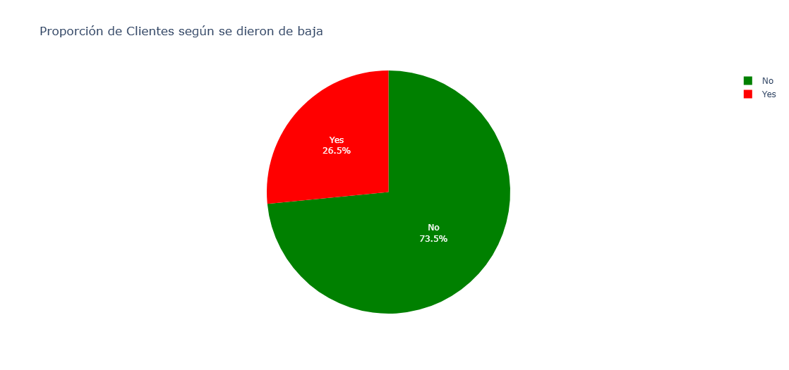
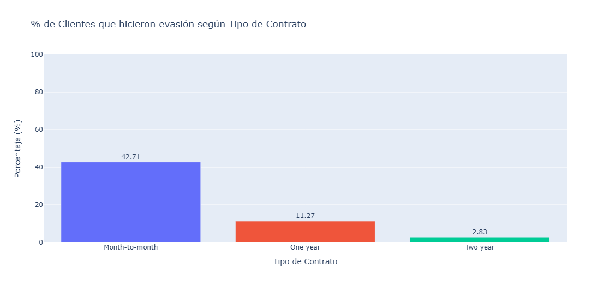
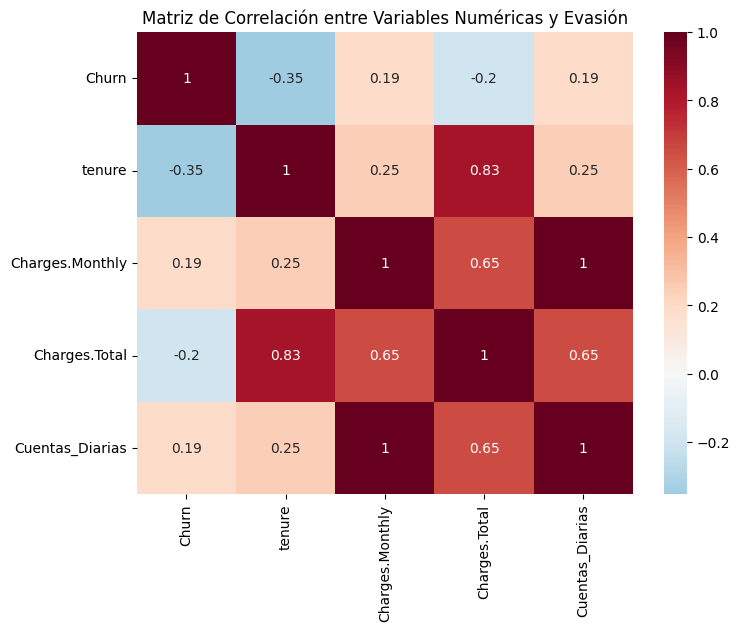

# 📊 Análisis de Evasión de Clientes - Telecom X

Este proyecto consiste en el análisis exploratorio de datos (EDA) sobre la evasión de clientes de una empresa ficticia de telecomunicaciones llamada **Telecom X**. El objetivo es identificar patrones y factores que influyen en la cancelación del servicio, con el fin de desarrollar estrategias para mejorar la retención de clientes.

---

## 🚀 Objetivo

Telecom X enfrenta una alta tasa de cancelación de clientes y busca comprender las razones detrás de esta evasión. A través de la manipulación y visualización de datos, se busca:

- Analizar las características de los clientes que cancelan el servicio.
- Explorar variables numéricas y categóricas relacionadas con la evasión.
- Crear visualizaciones estratégicas para respaldar hallazgos.
- Proporcionar insights que sirvan de base para futuros modelos predictivos.

---

## 🧰 Herramientas y Tecnologías

- **Python 3**
- **Pandas** – manipulación de datos
- **Plotly Express** – visualización de gráficos interactivos
- **Seaborn & Matplotlib** – gráficos estáticos y matrices de correlación
- **Google Colab** – entorno de desarrollo

### 📊 Distribución General de Evasión

### 📊 Evasión según Tipo de Contrato

 

### 📊 Matriz de Correlación

## 📝 Análisis Realizado

1. **Importación y limpieza de datos**
   - Conversión de tipos
   - Manejo de nulos y valores inconsistentes

2. **Análisis Exploratorio (EDA)**
   - Distribución de evasión general
   - Comparación por variables categóricas (contrato, género, método de pago)
   - Comparación por variables numéricas (tenure, gastos, cuentas diarias)

3. **Análisis adicional**
   - Correlaciones entre variables
   - Evasión vs número de servicios contratados
   - Creación de variable `Cuentas_Diarias`

4. **Conclusiones**
   - Identificación de factores clave asociados a la evasión
  

## 🧑‍💻 Autores
**AluraLatam**  
**Jhonatan Moreno Velásquez**  
Aspirante a Analista de Datos | Apasionado por convertir datos en decisiones  
📧 www.linkedin.com/in/jhonatanmorenovelasquez

---

## 📄 Licencia

Este proyecto es de uso educativo y abierto para fines de aprendizaje.

